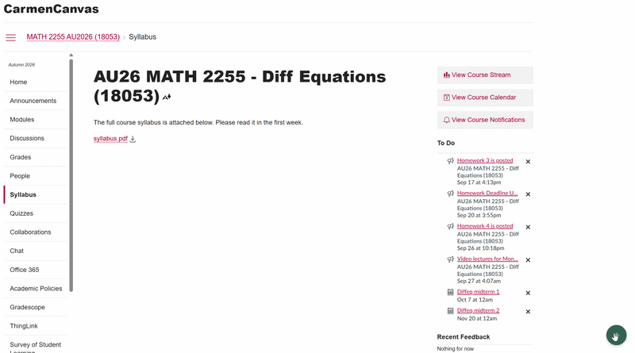
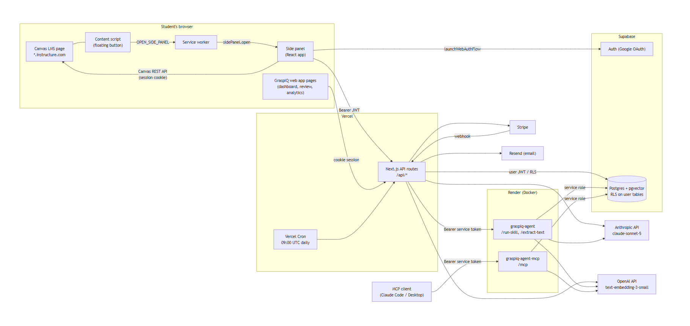

# GraspIQ

**An AI study assistant for Canvas LMS.** 100+ users across Canvas-hosted colleges within two weeks of launch.

[Chrome Web Store](https://chromewebstore.google.com/detail/graspiq/pmhbfohnlaeipmfpjmmnnjgjlachgjcc) · [Web App](https://grasp-iq-pi.vercel.app)

<!-- Replace with a 10 to 15 second GIF: open side panel, ask a course question, generate a practice test -->

> The source code is private because GraspIQ is a live product with paying users. This repo documents the architecture and engineering decisions. Happy to walk through the code in an interview.

---

## What it does

GraspIQ reads a student's course content through their live Canvas session and turns it into study tools:

- **Course Q&A** grounded in actual course files via retrieval-augmented generation
- **Study guides** with one-click Word export
- **Practice tests** (multiple choice, true/false, short answer, extended response) with AI grading and weak/strong topic feedback
- **Exam cram plans**, spaced repetition (SM-2), streaks, and a built-in Pomodoro timer

Works with any Instructure-hosted Canvas school, not tied to a single institution.

## Architecture

<!-- Extension -> Next.js web app (Vercel) -> Agent service (Render) -> Claude API / pgvector / Supabase -->

| Component | Stack |
|---|---|
| Chrome extension | Manifest V3 (side panel, popup, content script), React 19, TypeScript, Vite, Tailwind CSS v4 |
| Web app | Next.js (App Router), TypeScript, Vercel |
| AI agent service | Node.js / Express, TypeScript, Docker, Render |
| AI | Claude API with an agentic tool-use loop and 7 skill modules; OpenAI embeddings + pgvector for RAG |
| MCP server | Standalone, bearer-token authenticated, exposed alongside an internal HTTP API |
| Data and auth | Supabase (Postgres, Row Level Security, Auth) with Google sign-in synced across extension and web |
| Payments | Stripe Checkout with webhook-driven subscription state |

## Engineering highlights

**Splitting the agent out of serverless.** Vercel's serverless model can't keep a long-running MCP server alive, so the agent runs as its own Dockerized service on Render, with the web app and extension calling into it.

**A production-only bug.** Requests worked in dev but returned 500s in production. The cause: the build script silently skipped copying the markdown skill files into the Docker image. Fixed the build step and added the files to the image explicitly.

**Cross-institution support.** The Canvas base URL is derived per school at runtime, so one extension works across any Canvas-hosted college. Since Canvas discontinued personal API tokens, data is read through the student's own authenticated session.

**Live payments.** Migrated Stripe from sandbox to production and verified a full real transaction end to end: charge, webhook, and refund.

**Extension edge cases.** Handled Chrome extension context invalidation after auto-updates, and passed Chrome Web Store review by trimming manifest permissions and matching privacy disclosures to actual data flows.

## Privacy and security

- Row Level Security enforced on every query
- Data minimization: generation requests send only the files a student selects, not the whole course
- Card details never touch GraspIQ servers (Stripe Checkout)
- Minimal extension permissions (storage, sidePanel, identity), host access scoped to Canvas domains and the GraspIQ backend, no `<all_urls>`
- No ad tracking or data sale; the privacy policy names every third-party processor and what it receives

## Screenshots

<!-- Add 3 to 4: side panel chat, practice test with grading feedback, study guide, stats/streaks -->

---

Built solo by [Simon Lunay](https://www.simonlunay.com) · [LinkedIn](https://www.linkedin.com/in/simonlunay)
